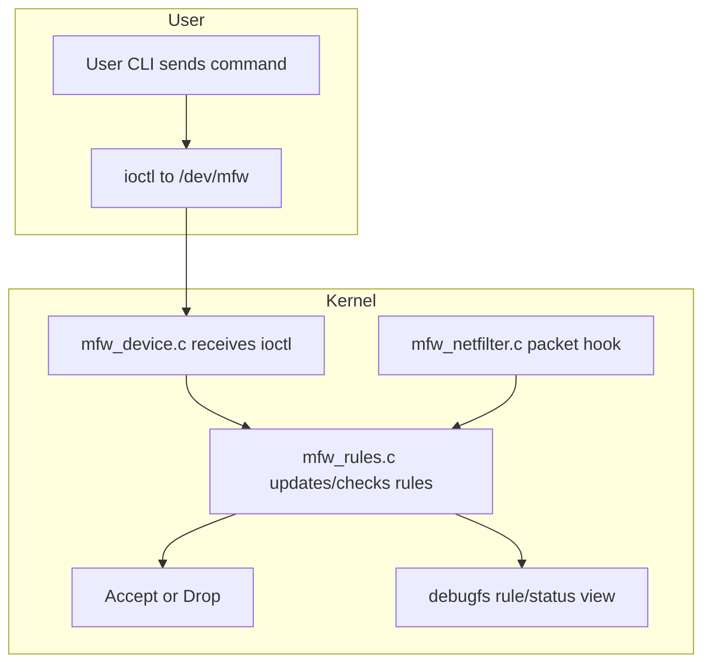

# Mini Linux Firewall Framework

Educational Linux systems project for practicing C, Linux kernel modules, user/kernel communication, Netfilter hooks, rule tables, counters, logging, debugfs, and debugging.

> Run this only inside a Linux VM. A bug in kernel code can crash the machine.

## What this project implements

- Kernel module: `kernel/mfw.c`
- User-space CLI: `user/mfwctl.c`
- Shared UAPI header: `include/mfw_uapi.h`
- Communication: `/dev/mfw` + `ioctl`
- Packet path hook: IPv4 `NF_INET_LOCAL_IN`
- Rule type: match source IPv4 address
- Actions: `DROP` or `PASS`
- Counters: hit counter per rule
- Logging: `pr_info_ratelimited()` visible in `dmesg`
- Status: `/sys/kernel/debug/mfw/rules`

## Basic flow

The firewall has two main paths:

1. User commands flow from `user/mfwctl` to the kernel via `/dev/mfw` and `ioctl`.
2. Packet flow enters the Netfilter hook in the kernel and is checked against the rule table.



If Mermaid rendering is unavailable, the flow is:

- `user/mfwctl` builds a rule command and calls `ioctl` on `/dev/mfw`.
- `kernel/mfw_device.c` receives the ioctl and updates or queries the rule table.
- `kernel/mfw_netfilter.c` intercepts packets and asks `kernel/mfw_rules.c` whether the source IP matches a rule.
- The kernel returns `ACCEPT` or `DROP`, and the rule state is visible through debugfs.

## Requirements

Ubuntu/Debian example:

```bash
sudo apt update
sudo apt install -y build-essential linux-headers-$(uname -r) kmod strace tcpdump gdb netcat-openbsd
```

On Fedora:

```bash
sudo dnf install -y gcc make kernel-devel kernel-headers strace tcpdump gdb nc
```

## Build

```bash
make
```

This builds:

```text
kernel/mfw.ko
user/mfwctl
```

## Load and unload

Load:

```bash
sudo insmod kernel/mfw.ko
```

Check logs:

```bash
dmesg | tail
```

Unload:

```bash
sudo rmmod mfw
```

## Use the CLI

List rules:

```bash
sudo ./user/mfwctl list
```

Add a drop rule:

```bash
sudo ./user/mfwctl add 192.168.56.1 drop
```

Add/pass-update a rule:

```bash
sudo ./user/mfwctl add 192.168.56.1 pass
```

Delete a rule:

```bash
sudo ./user/mfwctl del 192.168.56.1
```

Clear all rules:

```bash
sudo ./user/mfwctl clear
```

Read debugfs status:

```bash
sudo cat /sys/kernel/debug/mfw/rules
```

## Testing idea

Recommended topology:

```text
Client VM  --->  Firewall VM running this module
```

1. On the Firewall VM, load the module.
2. Add the Client VM source IP as a drop rule.
3. From the Client VM, ping or connect to the Firewall VM.
4. Watch counters and logs on the Firewall VM.

Example on Firewall VM:

```bash
sudo insmod kernel/mfw.ko
sudo ./user/mfwctl add <CLIENT_VM_IP> drop
sudo ./user/mfwctl list
sudo cat /sys/kernel/debug/mfw/rules
sudo dmesg -w
```

From Client VM:

```bash
ping <FIREWALL_VM_IP>
nc -vz <FIREWALL_VM_IP> 22
```

Back on Firewall VM:

```bash
sudo ./user/mfwctl list
sudo cat /sys/kernel/debug/mfw/rules
```

The hit counter should increase.

## Debugging checklist

### Kernel logs

```bash
sudo dmesg -w
```

### User-space syscall tracing

```bash
sudo strace ./user/mfwctl list
sudo strace ./user/mfwctl add 192.168.56.1 drop
```

### Packet visibility

```bash
sudo tcpdump -ni any host 192.168.56.1
```

### Device file

```bash
ls -l /dev/mfw
```

### Module status

```bash
lsmod | grep mfw
modinfo kernel/mfw.ko
```

## Safe recovery

If you accidentally block useful traffic:

```bash
sudo ./user/mfwctl clear
```

If needed:

```bash
sudo rmmod mfw
```

If the VM becomes unstable, reboot the VM.

## Current limitations

This is intentionally small:

- IPv4 only.
- Source IP match only.
- Hooks only `LOCAL_IN`, so it filters packets destined to the machine itself.
- No TCP/UDP port matching yet.
- No CIDR/subnet rules yet.
- No stateful connection tracking yet.
- No NAT.
- No RCU optimization.
- Not production safe.

## Suggested next milestones

1. Add destination IP matching.
2. Add TCP/UDP port matching.
3. Add CIDR masks.
4. Add hook selection: `LOCAL_IN`, `FORWARD`, `LOCAL_OUT`.
5. Replace `ioctl` with Netlink.
6. Add a real rule ID and deletion by ID.
7. Add per-CPU counters.
8. Add RCU for lockless packet-path lookup.
9. Add a small test lab with Linux network namespaces.
10. Add README diagrams and interview-style explanation.
